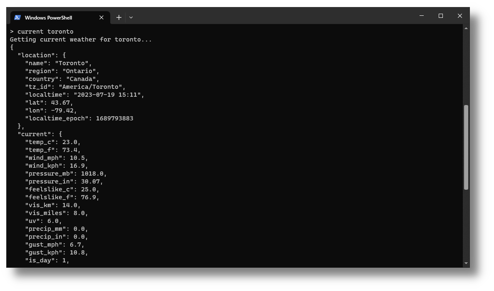
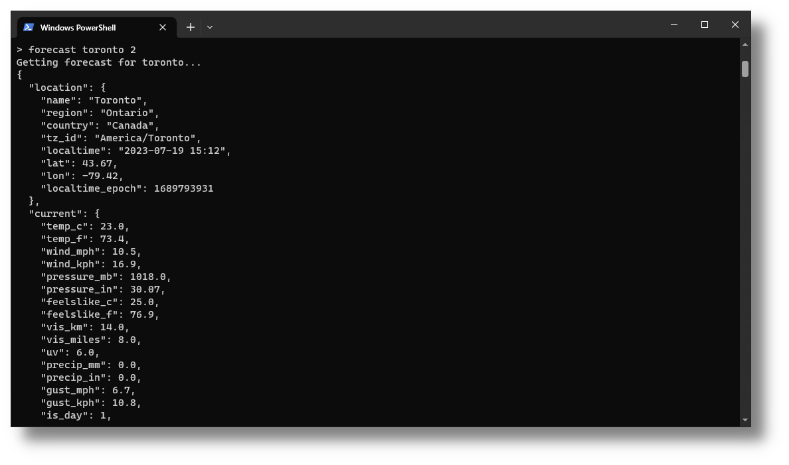
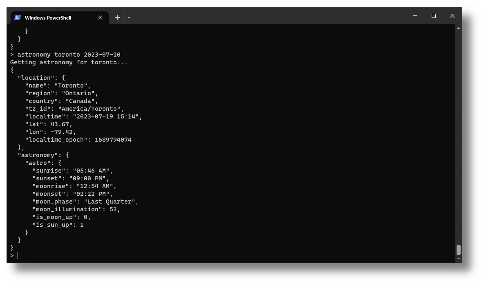
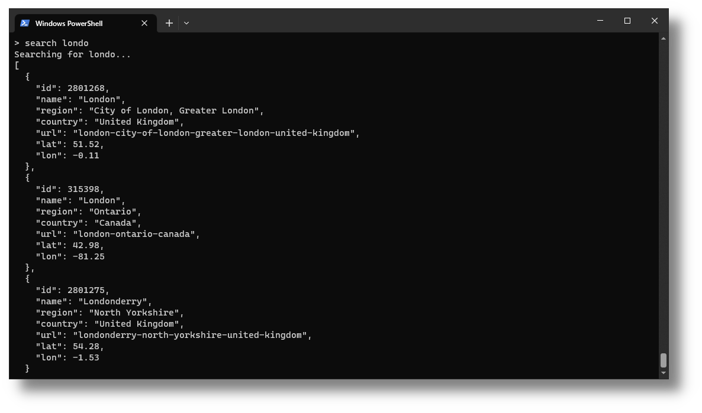
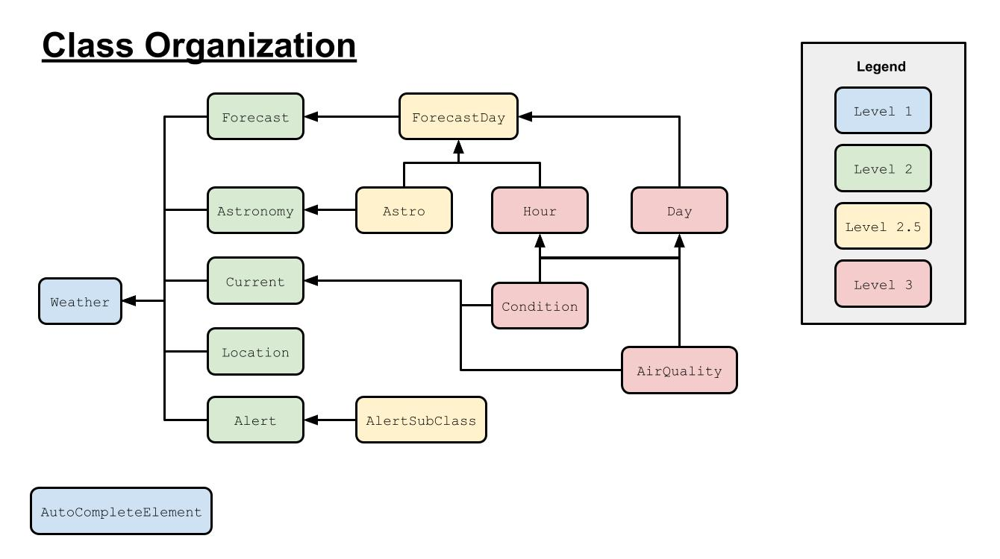

# RainyDay (Console Client/API)

<!-- TOC -->
* [RainyDay (Console Client/API)](#rainyday-console-clientapi)
  * [Introduction](#introduction)
  * [Features](#features)
    * [Current Weather](#current-weather)
    * [Forecasted Weather](#forecasted-weather)
    * [Astronomy](#astronomy)
    * [Searching Weather Database](#searching-weather-database)
  * [Data Organization](#data-organization)
    * [Organization Diagram](#organization-diagram)
  * [Using The API In Your Own Code](#using-the-api-in-your-own-code)
    * [Current Weather Via API](#current-weather-via-api)
    * [Forcasted Weather Via API](#forcasted-weather-via-api)
    * [Astronomy Via API](#astronomy-via-api)
    * [Location Search Via API](#location-search-via-api)
<!-- TOC -->

## Introduction
RainyDay is a simple weather application that provides complete weather information built in Java. It utilizes
the free RESTful [WeatherAPI](https://www.weatherapi.com/) as the information source and utilizes the [gson](https://github.com/google/gson) library for JSON 
serialization and deserialization. This version is purely a console client; it doesn't include the JavaFX GUI that 
the general RainyDay Application has. This version is essentially a fully-functional higher level API built off of 
WeatherAPI that allows for seamless weather data retrieval in Java:


In addition to simply viewing the weather data, it also provides stores the data in separate classes.
Therefore, this code from those classes can be easily modified for use in any application requiring 
weather information. Therefore, the classes in the console version are the backbone of the GUI vesion.

## Features
All the features and their associated commands are shown upon application startup. These features are `CURRENT`, 
`FORECAST`, `ASTRONOMY`, `SEARCH`. Of course, you can also exit the application with `EXIT`. Additionally, the
commands are case-insensitive. This means that `forecast` is the same as `FORECAST`, similar to SQL commands.
Note that whenever a location is required for a command, it can be provided in the following forms and is
case-insensitive:

<div align="center">

| Type               | Example                |
|--------------------|------------------------|
| City Name          | Toronto                |
| Specific City Name | toronto-ontario-canada |
| Postal Code        | 90210                  |
| IP Address         | 192.158.1.38           |
| Longitude/Latitude | 38.8/-77.03            |

</div>

### Current Weather
The current weather data for a location can be found with the `CURRENT` command. This command takes in a location.



### Forecasted Weather
The forecasted weather can be found with the `FORECAST` command. Since I'm using
the free version of WeatherAPI, the program is limited to viewing only up to 3 days from the current day with a 
forecast request. This can be improved if you replace the key with an upgraded account key in the `Connection.java`
file. This command takes in a location and then the number of days to forecast. This command gets both the current
weather and the forecasted weather.



### Astronomy
Weather-related astronomy can be found with the `ASTRONOMY` command. This command takes in a location and a date
to get the astronomy for.



### Searching Weather Database
The WeatherAPI database can be searched for using the `SEARCH` command. This command is useful to figure out the
complete name for the location you want to get information for. It takes in a partial location term (see above
for definition of a location term):



## Data Organization
As mentioned, the data from WeatherAPI is deserialized into various classes, and these classes are modular and 
portable such that they can be used in any application for weather data. These classes are organized into levels as a 
hierarchy. These classes are:

<div align="center">

| Class                 | Description                                            | Level | Parent Classes             |
|-----------------------|--------------------------------------------------------|-------|----------------------------|
| `Weather`             | Stores all weather information from the API            | 1     | None                       |
| `AutoCompleteElement` | Stores the location search information                 | 1     | None                       |
| `Location`            | Stores location information                            | 2     | `Weather`                  |
| `Current`             | Stores all current weather information                 | 2     | `Weather`                  |
| `Forecast`            | Stores all forecasted weather information              | 2     | `Weather`                  |
| `Astronomy`           | Stores all weather astronomy information               | 2     | `Weather`                  |
| `Alert`               | Stores all emergency weather alerts                    | 2     | `Weather`                  |
| `Astro`               | Stores the weather astronomy                           | 2.5   | `Astronomy`, `ForecastDay` |
| `AlertSubClass`       | Subclass for Alert class                               | 2.5   | `Alert`                    |
| `ForecastDay`         | Stores the forecast for a specific day                 | 2.5   | `Forecast`                 |
| `Condition`           | Stores the current weather condition information       | 3     | `Current`, `Hour`, `Day`   |
| `AirQuality`          | Stores the air quality information                     | 3     | `Current`, `Hour`, `Day`   |
| `Hour`                | Stores the weather for particular hour in the forecast | 3     | `ForecastDay`              |
| `Day`                 | Stores the weather for a particular day                | 3     | `ForecastDay`              |

</div>

### Organization Diagram
The classes can be better represented in the following diagram:



## Using The API In Your Own Code
Really, the code in this console client can be used as a higher level API for any weather data you may want for your
own developed application. All the data is nicely organized in the class structure above, so it should be really easy
for you to implement in your own applications. First, simply create a `Connection` object (from package `org.rainyday`), 
which will allow you to use the various features RainyDay has to offer via its methods:

```java
private static Connection rainyDayAPIConnection = new Connection();
```

Then, you can call the corresponding API method you would like for the corresponding feature, and use the getter
methods on the returned object to get the data you would like.

### Current Weather Via API
To get the current weather, simply use the `getCurrentWeather()` method. This method takes in a location and 
will return a `Weather` object with the data:

```java
// get the current weather for Toronto, Ontario, Canada
private Weather currentWeather = rainyDayAPIConnection.getCurrentWeather("Toronto");

// For example, get the current temperature in degrees celsius
double currentTemp = currentWeather.getCurrent().getTemp_c();
```

### Forcasted Weather Via API
To get the current weather _and_ the forecasted weather, use the `getForecast()` method. This method takes in a 
location and the # of days forward you want to get the data for, ranging from 1-3, and returns a `Weather` object:

```java
// get the forecasted weather for Toronto, Ontario, Canada for 3 days
private Weather forecastedWeather = rainyDayAPIConnection.getForecastedWeather("Toronto", 3);

// get the current temperature at 10:00 AM for tomorrow
double futureTemp = forecastedWeather.getForecast().getForecastday().get(1).getHour().get(10).getTemp_c();
```

### Astronomy Via API
To get the weather astronomy for a location, use the `getAstronomy()` method. This method takes in a location and a 
date, to return a weather object. Note by default astronomy data is included in the `getForecast()` API call as well:

```java
// get the weather astronomy for Toronto, Ontario, Canada on July 21, 2023
private Weather astronomyData = rainyDayAPIConnection.getAstronomy("Toronto", "2023-07-21");

// get the sunrise time for 2023-07-21
private String sunriseTime = astronomyData.getAstronomy().getAstro().getSunrise();
```

### Location Search Via API
To search the WeatherAPI database for a specific location, use the `getAutocompleteTerm()` method. This method takes in
a keyword and returns an `ArrayList<AutoCompleteElement>` with all the matched locations.

```java
// search with the keyword "Jacks"
private ArrayList<AutoCompleteElement> matchedLocations = rainyDayAPIConnection.getAutoCompleteTerm("Jacks");

// get the first matched term
matchedLocations.get(0).getName();
```