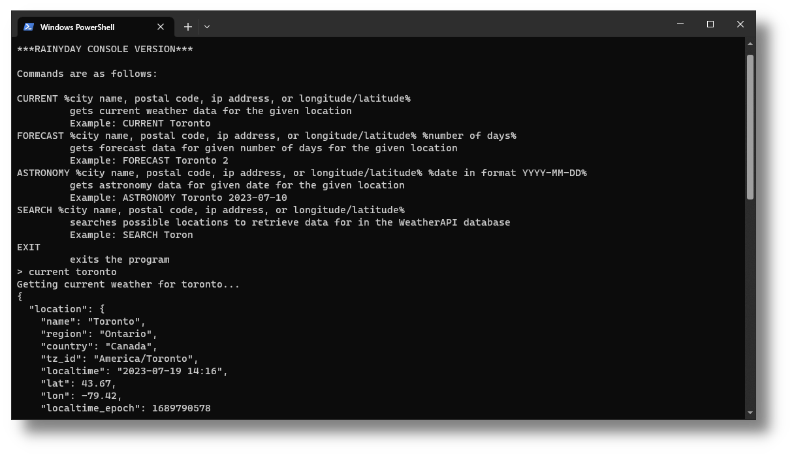

# RainyDay - *ConsoleVersion*

## Introduction
RainyDay is a simple weather application that provides complete weather information built in Java. It utilizes
the free [WeatherAPI](https://www.weatherapi.com/) as the information source and utilizes the
[gson](https://github.com/google/gson) library for JSON serialization and deserialization. This version is purely
a console version; it doesn't include the JavaFX GUI that the general RainyDay Application has. However, it does have
all the same functionality for data retrieval:

## Features
### Current Weather
### Forecasted Weather
### Astronomy
### Searching Weather Database